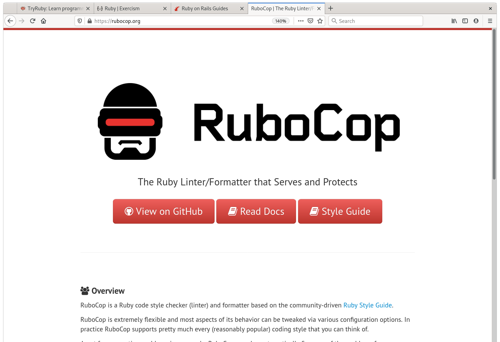

<!--
Ahoi! This is Ruby for the win! For the Linuxtage 2021
-->

# Lets say:

Programming Languages are (kind of) Tools

<!--
From certain point of view programming languages have lot of similarities to
choosing tools for a job. So lets say programming languages are kind of tools.

They have in common that they were created to solve a certain problem in a
different, mostly more simple or elegant way.

Therefor we might say that the more tools you know, the better you will know if
you could save some time, effort or sanity.
-->

# Learn a Programming Language Every Year

Do not strictly compare, but try to understand its purpose.

<!--
There is a good practice that ensure us we keep up studying. It is to learn
a new programming language every year.

If you learn at least one programming language a year it will enrich your
perspective on different problems and help you figure out better solutions.

Suppose you lean a new language, do not compare to what you currently are aware
of but try to figure out what the inventors of this tool were trying to solve.
-->

# Christoph Lipautz


<!--
I'm Christoph and I spent a lot of time building software. On a daily basis I
do this using go, sometimes python, javascript or and some other tools.

I'm especially grateful that I can spent a lot of time using ruby.

In this talk I want to give you some insights on why I love to work with ruby.

As this is a live (remote) presentation, feel free to interrupt me anytime
to ask a question. Or at least save them for the Q/A session afterwards.
-->

# Overview of this Talk

- Why did I stick with Ruby for so many years?

- Super Brief Basics (Code)

- An Example dealing with Time (Code)

- Resources, Getting Started, More Code(?)

- Question and Answer Session

<!--
I picked up ruby for the first time somewhere around 13-15 years ago and it
resisted to be the tool of choice. For the first part of this talk I want
to give some background on the language, following with a very brief
introduction.

Then we'll have a look on a code example and play with time.

After that I share some selected resources, point you to proper help
to get started, and do more coding if there is time left.

In the final part there is extra time reserved for a Q and A session.

Lets get started.
-->

# Ruby\footnote{https://www.ruby-lang.org/}

 Designed for Developer Happiness

<!--
Ruby is an object oriented and interpreted programming language that is know to
focus on developer happiness.

Any ruby software creators profit from code that is easy to write.
But even more important the source produced is extra easy to read.
-->

# Hello World!

```ruby
7.times { print "Hello World!\n" }
```

<!--
Pretty easy to guess what the code snippet does, right?
-->

# Hello World!!

```ruby
7.times { print "Hello World!\n" }
# Hello World!
# Hello World!
# Hello World!
# Hello World!
# Hello World!
# Hello World!
# Hello World!
```

<!--
I could have also ask what "seven times print hello world" will do ^^

This Ruby code style can be attributed to the inventor and chief designer of
the language.
-->

# Yukihiro "Matz" Matsumoto


<!--
His name is Yukihiro Matsumoto. He is also referred to as Matz and has a strong
eye on the language structure and design.

And it seems he is also responsible for the very nice community of Ruby.
-->

# A Welcoming Community

Matz is nice, so we are nice.

<!--
A widely known statement in the Ruby community is Matz is nice, so we are nice.

So what can you expect from Ruby?
-->

# What can you expect from Ruby?

- A Welcoming Community

- Conventions, Best Practice, No Strict Rules

- A Well Aged Environment

<!--
In my very personal view:

A very nice community, that is helpful, and welcomes you at any point.

No rules to follow but good examples and best practices. Also ruby code that
feels familiar when writing or reading because of conventions you learn.

Due to its quite long history you can expect a large, stable and battle tested
environment.
-->

# Conventions

Expect conventions and best practice, but no strict rules.

<!--
Let's have a closer look to what I mean with mentioning conventions.
-->

# Conventions?

```ruby
a = [1, 2, 3]
a.member? 2 # true

# as convention: expect methods ending with ? to
# respond with a boolean
user.active?
```
<!--
Ruby allows you to use UTF-8 in the source, so you can e.g. define method names
that end with a question sign.

Any time you see such a method, you can for sure expect that it will return
either some value that evaluates to true or false.

This is no feature of the language, but the way the community sorted out would
be a good style.

NOTE: explain source code example
-->

# Conventions!

```ruby
a = [1, 2, 2]
a.uniq # [1, 2]
print a # [1, 2, 2]
# as convention: expect methods with ! to do something
# destructive (or dangerous)
a.uniq! # [1, 2]
print a # [1, 2]
```

<!--
As another example if a method ends with an exclamation mark, it will do
something destructive like changing the internals of an object or raising
an exception if arguments or internals that are provided are not as expected.

NOTE: explain source code example
-->

# Everything is a file

Everything in Unix is a file

<!--
From Unix-like systems we go by the convention that everything is a file.
-->

# Everything is a object

Everything in Ruby is a object

<!--
In Ruby everything is a
-->

# Everything is an object

Everything in Ruby is an object

<!--
...everything is an object
-->

# Lets GO ^^

<!--
Lets write some code:

interactive ruby irb...

1 + 1 # ruby has scalar types, like integers
1.0 + 1.0 # floats
"foobar" # for sure also strings
:foobar # and to optimize memory using strings in code, it provides symbols
# don't mind any details on symbols, we won't need them
x = [1, "foo", "bar", 2] # other important types are arrays
x[2] # bar
x = { one: 1, two: 2, foo: 'bar' } # and hashes
x[:foo] # bar
# we define a class like this
class A
  def foo
    "first"
    "last"
  end
end
a = A.new

# calling method foo of object instance stored in a we tend to say: sending
# message :foo to the instance.
a.foo # last ... last line is returned, no explicit return required

# for sure we could also use an explicit return state but we tend to skip
# things that are not necessary to improve readability.
# same goes for braces, not all are required
a.foo()

# Note that this allows you to choose what you like best, but most Rubyists
# tend to same or similar styles over time. For sure you can also use static
# code analyzer that will help you figure out style rule violations, and inform
# about best practice.
# as everything is an object, we can send messages to primitives
1.zero?

# ... we could even check for the methods available for an object at hand.
1.public_methods
-->

# Ruby on Rails in Action

```ruby
users = User.where :created_at.gte => 3.days.ago
```

<!--
When I started with Ruby, one of the very first things that blew my mind
was the way you can deal with Time. This line of code is extracted from a
project that is using the popular web framework Ruby on Rails.
As time handling was such pain to do for me before I was really exited to see
such an easy approach.

For this presentation I decided to build a package that offers this
functionality from scratch. For sure in a very simplified version, but we
should end up being able to recreate this statement.
-->

# Timeless Project

<!--
NOTE: build some code
-->

# A Word of Warning

Don't mess with primitives.

<!--
The code written was build for demonstration purpose but it might be a bad
idea to start dealing with Ruby and starting by manipulating its very
basic objects.
-->

# Resources

Where should I start?

<!--
To get started with Ruby I'd recommend four sites.
-->

# Try Ruby\footnote{https://try.ruby-lang.org/}


<!--
Visit try ruby to have an interactive playground and get a guided tour of
the basics.
-->

# Join Exercism\footnote{https://try.ruby-lang.org/}


<!--
Have a look at Exercism, which is a open source platform that supports you when
learning a programming language. It currently has around 50 language tracks,
where you solve tasks and get feedback of real people. Note that those people
are volunteers, so don't be mad if it takes some time to get some review of
your solution.

I follow this project since 2013 and also contribute as mentor for several
language tracks. Chances are good that you receive some code review from me on
your solution written in Ruby.
-->

# Visit Rails Guides\footnote{https://guides.rubyonrails.org/}


<!--
If you are into web development you should definitely browse through the guides
of the Ruby on Rails framework which is the basis of websites like GitHub,
GitLab and Shopify.
-->

# Run RuboCop\footnote{https://rubocop.org/}



<!--
When you've spent some time with ruby, it's time to meet its widely used static
code analyzer RuboCop. This tool will help you to use and understand best
practices from the Ruby community. For me it took quite some time to stop
hating this tool and get the value behind, so don't give up easily.
-->

# Slides, Code, Contact - Thanks a lot for Joining!!!

Christoph Lipautz

- @unused in #glt21 chat at IRC OFTC

- [\@unused](https://github.com/unused) at GitHub

- [\@lipdaguit](https://twitter.com/lipdaguit) on Twitter

Find Presentation Slides and Code at:
  [https://github.com/unused/ruby-ftw](https://github.com/unused/ruby-ftw)

<!--
I'm Christoph and use unused as nickname in the
linuxtage IRC channel at OFTC. You can also find me on GitHub as unused. This
presentation and all code can be found there as well.

If you want to contact me after the event you'll probably find some email
address, but the easiest way is using Twitter.

Thank you for joining!
-->
