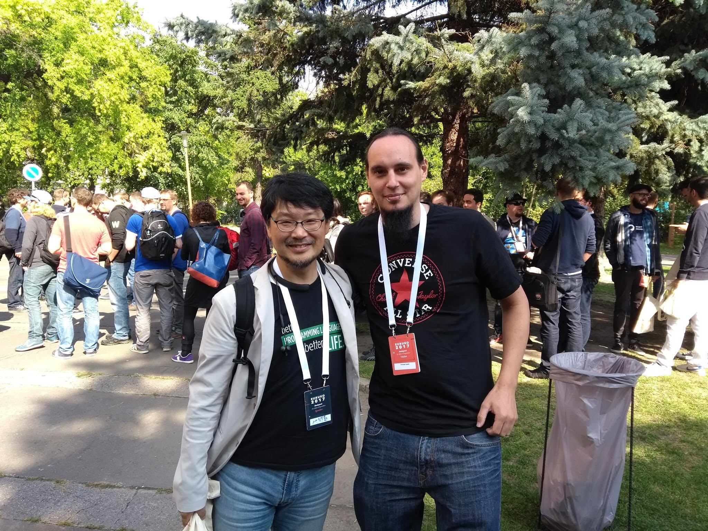
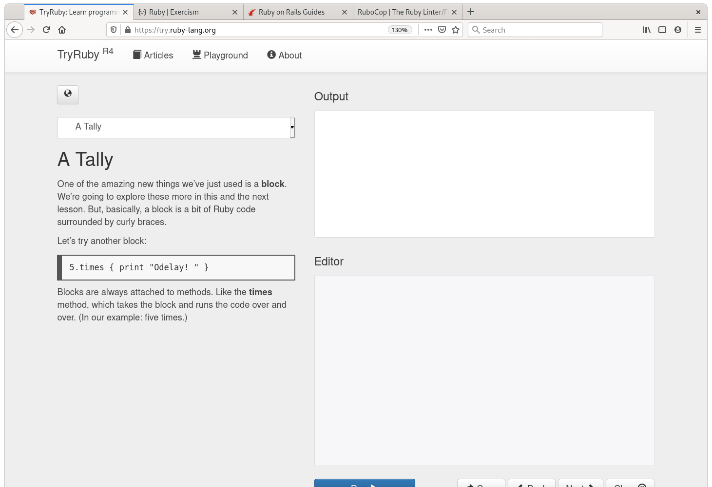
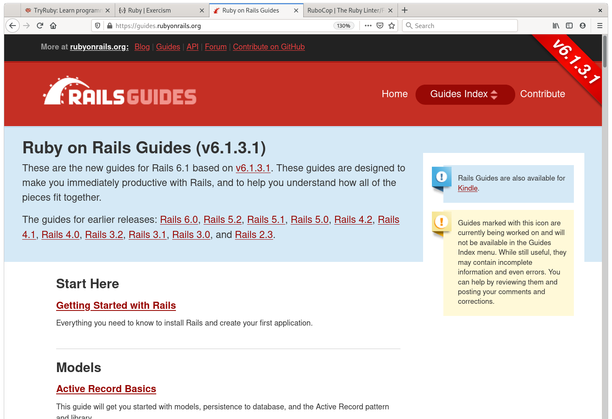

<!--
Ahoi! This is Ruby for the win! For the Linuxtage 2021
-->

# Lets say:

Programming Languages are (kind of) Tools

<!--
From certain point of view programming languages have lot of similarities to
choosing a tool for a certain job. So lets say programming languages are kind
of tools.

They have in common that they are created to solve some problem in a different,
mostly more simple or elegant way than other tools do.
-->

# Tool FTW\footnote{https://unsplash.com/photos/NL\_DF0Klepc}


<!--
Therefor we might say that: The more tools you know, the better you know if
you could save some time, effort or sanity using something else.
-->

# Learn a Programming Language Every Year

Do not strictly compare things to what you know, but try to understand its
purpose.

<!--
There is a good practice that ensures we keep up studying. It states that we
should learn at least one new programming language every year.

If you study new concepts from time to time it will not just enrich your
toolset...
...It will also change your perspective on different problems.
...And it will help you figure out better solutions.

Suppose you learn a new language, then do not compare to what you currently are
aware of.
...Try to figure out what the inventors of this tool were trying to solve.
-->

# Christoph Lipautz


<!--
I'm Christoph and I spent a lot of time building software.
For the last decade I tried to study at least one new programming language
every year.
Now I use go, sometimes python, javascript and some other tools on a daily
basis.
However I'm especially grateful that I can spent a lot of time using Ruby.

In this talk I want to share with you some of my thoughts of Ruby.
As I think the best way to get to know something is to see it in action I will
do some live coding rather than going through all of the good and bad parts
of the language.

As this is a live (remote) presentation, feel free to ask questions any time
in the chat.
...Or write them down for the Q/A session after the talk.
-->

# Overview of this Talk

- Why did I stick with Ruby for so many years?

- Super Brief Basics (Code)

- An Example dealing with Time (Code)

- Resources, Getting Started, More Code(?)

- Question and Answer Session

<!--
I picked up Ruby for the first time somewhere around 13-15 years ago and it
resisted to be the tool of choice for me.
For the first part of this talk I want to give some background on the language,
following with a very very brief introduction.

Then we'll have a look on a code example, build a small package from scratch
and play with time.

After that I share some selected resources, point you to proper help
to get started, and do more coding if there is some time left.

In the final part there is some extra time reserved for a Q and A session.

Lets get started.
-->

# Ruby - Interpreted, Object Oriented\footnote{https://www.ruby-lang.org/}

 Designed for Developer Happiness

<!--
Ruby is an object oriented and interpreted programming language that is know to
focus on developer happiness.

Any ruby software creators profit from code that is easy to write.
But even more important the source produced is extra easy to read.
-->

# Hello World!

```ruby
7.times { print "Hello World!\n" }
```

<!--
Pretty easy to guess what the code snippet does, right?
-->

# Hello World!!

```ruby
7.times { print "Hello World!\n" }
# Hello World!
# Hello World!
# Hello World!
# Hello World!
# Hello World!
# Hello World!
# Hello World!
```

<!--
I could have also just read out the statement:
  "seven times print hello world"
and ask you what do you think it will result to ^^

This style of code can be attributed to the inventor and chief designer of
the language.
-->

# Yukihiro "Matz" Matsumoto



<!--
His name is Yukihiro Matsumoto. He is also referred to as Matz and has a strong
eye on the language structure and design.

And it seems he is also responsible for the very nice community of Ruby.
-->

# A Welcoming Community

Matz is nice, so we are nice.

<!--
A widely known statement in the Ruby community is: Matz is nice, so we are
nice. And Rubyists tend to follow this mantra.
-->

# What can you expect from Ruby?

- A Welcoming Community

- A Well Aged Environment

- Conventions, Best Practice, No Strict Rules


<!--
So what can you expect from Ruby?

A very nice community, that is helpful, and welcomes you at any point.
...And I think I don't have to explain how valuable it is that you have
a community that loves to share code, knowledge and tends to be extra nice
to each other.

Due to its quite long history you can also expect a large, stable and battle
tested environment.

And there are no rules to follow but good examples and best practices.
After some time coding Ruby, the conventions given will just feel right.
Several times I've come up with almost the very same code to problems that I
later found written by someone else.
It is impressive to see how you learn to think in certain ways, without being
forced in a specific direction.
-->

# Conventions

Expect conventions and best practice, but no strict rules?

<!--
Let's have a closer look to what I mean with conventions.
-->

# Conventions?

```ruby
# as convention: expect methods ending with ? to
# respond with a boolean
user.active?

a = [1, 2, 3]
a.member? 2 # true
```
<!--
Ruby allows you to use UTF-8 in the source, so you can, as ... in the example,
define method names that end with a question sign.

Any time you see such a method, you can for sure expect that it will return
some value that evaluates either to true or false.

The code snippet has a variable user and active, suffixed with a question mark,
is send to it. It is likely that you will expect true or false reading this
line.
Same goes to the Array assigned to a below. The message clearly checks if two
is a member of that array.

This is no feature of the language, but the way the community sorted out would
be a good style.
No one tells you to do it that way, but now that you now it will be likely you
will write methods like that as well.
-->

# Conventions!

```ruby
a = [1, 2, 2]
a.uniq # [1, 2]
print a # [1, 2, 2]
# as convention: expect methods with ! to do something
# destructive (or dangerous)
a.uniq! # [1, 2]
print a # [1, 2]
```

<!--
As another example if a method ends with an exclamation mark, it will do
something destructive like changing the internals of an object or raising
an exception if arguments or internals that are provided are not as expected.

The array one, two, two responds with a new array one, two when uniq is sent.
Using the destructive method will not create a new array but change the
existing one.
It changes some internals and this might not be expected, therefor it notifies
the reader with the exclamation mark.
-->

# Everything is a file

Everything in Unix is a file

<!--
Before we start with the brief basics, I need to share a very important
feature of the language.

From Unix-like systems we go by the convention that everything is a file.
-->

# Everything is a object

Everything in Ruby is a object

<!--
In Ruby everything is a
-->

# Everything is an object

Everything in Ruby is an object

<!--
...everything is an object
-->

# Lets GO ^^

<!--
Lets write some code:

interactive ruby irb...

1 # responds with the result of the last statement
1 + 1 # ruby has scalar types, like integers
1.0 + 1.0 # floats
"foobar" # for sure also strings in double or single quotes
# and to optimize memory, it provides symbols as alternatives to string in your
# code.
:foobar
# don't mind any further details on symbols - just remember like strings
x = [1, "foo", "bar", 2] # other important types are arrays
x[2] # bar
x = { one: 1, two: 2, foo: 'bar' } # and hashes
x[:foo] # bar
# define methods like this
def foo
  return 'bar'
end
foo()
foo # and can also skip the braces.
# this is something that comes with Ruby: you can often write things in
# different form that will do the same thing. This is necessary when as we
# want to improve readability.

# we define a class like this:
class A
  def foo
    # here we omit the return statement, a method will always return something
    # and if not explicitly stated, it will use the last line of code
    "bar"
  end
end
a = A.new

# calling method foo of object instance stored in a we tend to say: sending
# message :foo to the instance.
a.foo # last ... bar is returned, no explicit return required

# Note that this allows you to choose what you like best, but most Rubyists
# tend to same or similar styles over time. For sure you can also use static
# code analyzer that will help you figure out style rule violations, and inform
# about best practice.

# as everything is an object, we can send messages to primitives
1.zero?

# ... and we could even check for the methods available for an object at hand.
1.public_methods

# call some of the public methods, like odd? or even?
-->

# Ruby on Rails in Action

```ruby
users = User.where :created_at.gte => 3.days.ago
```

<!--
Enough for the basics, let's have a look on the following line.

This line of code is extracted from a project that is using the popular web
framework Ruby on Rails.

When I started working with Ruby, one of the very first things that blew my
mind was the way you can deal with Time.
As time handling was such pain to do for me before
...I was really exited to see such an easy approach.

The line uses some database abstraction and queries alls users that were
created greater than equal three days ago...
or in the other way: all users created in the last 3 days

For this presentation I decided to build a package that offers this
functionality from scratch. For sure in a very simplified version, but we
should end up being able to recreate this statement.
-->

# Timeless Project

<!--
NOTE: build some code
-->

# A Word of Warning

Don't mess with primitives.

<!--
The code written was build for demonstration purpose.
If you want to start with Ruby, it might be a bad idea that the first thing you
do is manipulating its very basic objects.

For this presentation however I think it was a good fit :)
-->

# Resources

Where should I go now?

<!--
If you want to give Ruby a try, or already have and want to take a closer look
now, I want to share four sites with you.
-->

# Try Ruby\footnote{https://try.ruby-lang.org/}



<!--
The first one is try ruby on the official site of the language that gives you
a guided tour and a nice playground in your web browser.
-->

# Join Exercism\footnote{https://exercism.io/tracks/ruby}


<!--
Second, have a look at Exercism, which is a open source platform that supports
you when learning a programming language.
It currently has around 50 language tracks, where you solve tasks and get
feedback of real people.
Note that those people are volunteers, so don't be mad if it takes some time to
get reviews of your solution.

I follow this project since 2013 and also contribute as mentor for several
language tracks. Chances are good that you receive some code review from me on
your solution written in Ruby.
-->

# Visit Rails Guides\footnote{https://guides.rubyonrails.org/}



<!--
If you are into web development you should definitely browse through the guides
of the Ruby on Rails framework which is the basis of websites like GitHub,
GitLab and Shopify.

It is a collection of many packages that provides so much awesome Ruby code and
it also offers great ways to build web applications.
-->

# Run RuboCop\footnote{https://rubocop.org/}


<!--
When you've spent some time with Ruby, it is time to meet its widely used
static code analyzer RuboCop.
This tool will help you to use and understand best practices from the Ruby
community.
For me it took quite some time to stop hating this tool and get the value
behind, so don't give up easily.
-->

# Slides, Code, Contact - Thanks a lot for Joining!!!

Christoph Lipautz

- @unused in #glt21 chat at IRC OFTC

- [\@unused](https://github.com/unused) at GitHub

- [\@lipdaguit](https://twitter.com/lipdaguit) on Twitter

Find Presentation Slides and Code at:
  [https://github.com/unused/ruby-ftw](https://github.com/unused/ruby-ftw)

<!--
I'm Christoph and use unused as nickname in the
linuxtage IRC channel at OFTC. You can also find me on GitHub as unused. This
presentation and all code can be found there as well.

If you want to contact me after the event you'll probably find some email
address when duckduckgo'ing my name.

But the easiest way is to write me on Twitter.

Thank you for joining, looking forward to your questions!
-->
